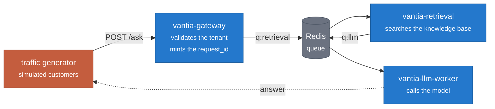
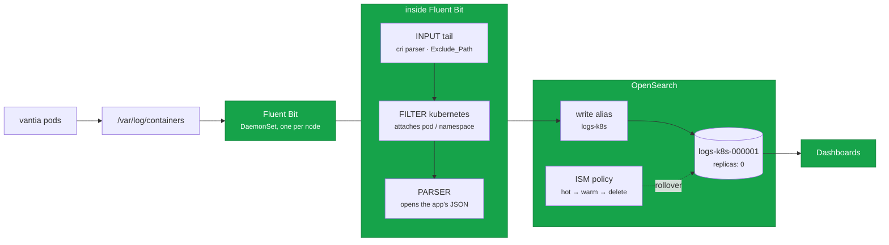

# observability-lab

**Vantia is a fictional company.** Its customers, its support tickets and its outages are invented.
The scenario is deliberately ordinary, because it is the scenario of a great many real companies —
but nothing here is a real client, and no real system is described.

This is a hands-on observability lab built on Kubernetes. It is not a tour of tools installed in
order. Every phase starts from **one concrete pain**, and ends when that pain is demonstrably gone.

---

## The company and its problem

Vantia is a B2B SaaS with an AI support assistant. A customer asks a question, the assistant searches
a knowledge base and answers. Three services, with a queue between them:



**The path is real, the work is simulated.** No model is ever called: latency and token counts come
from realistic distributions. That is on purpose. A real HTTP-then-queue path is what makes
correlation genuinely hard — and simulating the work means anomalies can be **injected on demand**
instead of waited for.

Four scenarios ship with it: `normal`, `slow_retrieval`, `token_spike`, `tenant_error`.

## Phase 1 — "we cannot reconstruct what happened"

> A customer complains about an answer the assistant gave on Tuesday. The logs live in three
> different pods, they vanish when a pod restarts, and nothing says which lines belong together.

### How it looks solved

```
$ ./scripts/find.sh 9b99e195c25f

  3 lines for this request

   17:26:44.090  gateway     accept    ok        0.93 ms
     pod vantia-gateway-6db65f8757-spkss
   17:26:44.253  retrieval   retrieve  ok      162.60 ms
     pod vantia-retrieval-7f8bc4b7f4-sxjxl
     docs_found=5
   17:26:46.138  llm-worker  generate  ok     1885.48 ms
     pod vantia-llm-worker-d497ff996-vxxs9
     tokens_in=1600  tokens_out=149  cost_usd=0.000197  model=small
     customer waited 2049 ms in total
```

**Those three pods no longer exist.** They were restarted afterwards. Measured, both ways:

| | before restarting every service | after |
|---|---|---|
| `kubectl logs` | 3 of 3 | **0 of 3** |
| OpenSearch | 3 of 3 | **3 of 3** |

Reproduce it yourself:

```bash
RID=$(./scripts/ask.sh acme | python3 -c 'import sys,json;print(json.load(sys.stdin)["request_id"])')
sleep 20
./scripts/trace.sh "$RID"    # the old way: ask every pod, one at a time
./scripts/find.sh  "$RID"    # the new way: ask one place

kubectl -n vantia rollout restart deploy/vantia-gateway deploy/vantia-retrieval deploy/vantia-llm-worker
./scripts/trace.sh "$RID"    # gone
./scripts/find.sh  "$RID"    # still there
```

### What was built



Two details that are not decorative:

- **`Exclude_Path` sits on the input, not on a filter.** Discarding later costs the same as not
  discarding: the file is read and the Kubernetes API is queried for metadata before anything is
  thrown away. Filtering at the input is also what makes it *structurally impossible* for Fluent Bit
  to ingest OpenSearch's own logs — otherwise an OpenSearch error produces log lines that produce
  more ingestion that produces more errors.
- **Fluent Bit writes to an alias, never to an index.** That is what lets the index underneath be
  born and deleted daily without the shipper ever knowing, and it is what lets one search span the
  whole history.

## The thread through every phase

The `request_id` that phase 1 propagates by hand — and that you have to *search for* — becomes, in
phase 3, an OpenTelemetry `trace_id` that propagates itself and **draws itself**.

It has to travel inside the queue message rather than in a header, because a queue breaks the call
stack: there is no request to attach context to, only a message left on one side and picked up on the
other, possibly seconds later, possibly by a different pod. That is the whole problem distributed
tracing exists to solve, met the hard way first.

## Alerting: telling someone without anyone watching

A dashboard only helps if somebody is looking at it. The one thing logs genuinely cannot
do is tell you: a rule that runs every minute cannot scan tens of thousands of documents.

So there is one alert, provisioned as code like everything else, on the cost query:

```yaml
# grafana/alerting.yaml
condition: C          # sum of cost_usd over 10 minutes > 0.60
for: 5m               # so a one-minute blip wakes nobody
repeat_interval: 1h
```

The threshold came from measuring rather than from picking a round number: ten-minute
windows sit at a median of $0.227, so $0.60 is 2.6x normal.

It posts to whatever `ALERT_WEBHOOK_URL` points at — Slack, a script, an agent that writes
you a sentence. Set it before deploying:

```bash
ALERT_WEBHOOK_URL=https://your-receiver.example ./scripts/bootstrap-secrets.sh
./scripts/deploy-grafana.sh
```

Left unset it points nowhere and says so, rather than failing quietly.

### Making it fire

The generator produces a steady mix, so the condition never happens on its own. Provoking
it is part of the design:

```bash
./scripts/spike-cost.sh       # spike
./scripts/cost-now.sh         # cost, threshold and rule state
./scripts/spike-cost.sh off   # back to normal
```

Raising only the share of expensive answers is not enough, and finding that out was the
interesting part. At 50% expensive requests the spend plateaued at twice normal and never
crossed: with more long answers the workers saturate, the queue backs up and fewer requests
complete. **The system's own backpressure caps the spend.** A real bill spike is pricier
requests *and* more of them, so the script moves the mix, the rate and the capacity
together.

Two details worth stealing:

- The alert query reduces with `max`, not `last`. The final bucket of a date histogram is
  always partial, so `last` reads an artificially low value and the rule flaps between
  pending and inactive while the condition holds. A partial bucket is always smaller than a
  complete one, so `max` never picks it. The cost is a slower recovery — the alert stays on
  until the expensive bucket leaves the window.
- The OpenSearch datasource refuses a query with no bucket aggregation
  (`invalid query, missing metrics and aggregations`), so dropping the histogram is not an
  option.

## Roadmap

| # | The pain | What closes it | State |
|---|---|---|---|
| 1 | "We cannot reconstruct what happened" | Fluent Bit → OpenSearch, correlation, index lifecycle | **done** |
| — | "Nobody is watching the dashboard" | One alert on cost, provisioned as code | **done** |
| 2 | "Sometimes 3 seconds, sometimes 40, and we cannot say where they go" | Grafana + OpenTelemetry Collector + Tempo | next |
| 3 | "The model bill tripled and nobody knows what raised it" | Tokens and cost as span attributes, per tenant and stage | |
| 4 | "Engineering will not leave Grafana, and retention costs do not scale" | Loki as a second output of the same pipeline | |
| 5 | "I have the alert. Now where do I look?" | trace ↔ logs ↔ metrics correlation | |

## Running it

Applied in numeric order against any Kubernetes cluster:

```bash
kubectl apply -f deploy/00-namespaces.yaml -f deploy/01-priorityclass.yaml \
              -f deploy/02-limitranges.yaml -f deploy/03-admission-policy.yaml
kubectl apply -f deploy/10-vantia-redis.yaml -f deploy/11-vantia-app.yaml -f deploy/12-vantia-loadgen.yaml

./scripts/deploy-opensearch.sh    # chart pinned, single node
./scripts/deploy-dashboards.sh    # UI, LAN only
./scripts/bootstrap-index.sh      # index template, write alias, lifecycle policy
./scripts/deploy-fluent-bit.sh    # the shipper
./scripts/import-dashboard.sh     # prints the dashboard URL
```

The only UI in phase 1 is OpenSearch Dashboards. Grafana arrives in phase 2 with Tempo, which has no
interface of its own — adding Grafana earlier would only duplicate Dashboards without closing
anything.

The manifests pin workloads to a specific node and a `local-path` storage class; adjust
`nodeSelector` and `persistence.storageClass` for your cluster.

## Rules this lab follows

1. **Every pod sets a negative `priorityClassName`**, enforced by a `ValidatingAdmissionPolicy`. The
   lab may share a node with real workloads and must be the first thing evicted under pressure, never
   the last. The guardrail is enforced at admission because "remember to set it" is not a guardrail.
2. **Every PVC names its storage class.** Never assume the cluster default — and never put an index
   or a write-ahead log on network storage backed by spinning disks.
3. **Chart versions are pinned.** `helm upgrade` without `--version` resolves to whatever is newest.
4. **Kubernetes YAML in block style**, so it looks like what `kubectl get -o yaml` returns.
5. **A phase is not finished when the pods are green.** It is finished when the pain is closed,
   demonstrably, and the write-up exists.

## The lesson that repeated five times

Configured and active are not the same thing.

The priority class was written and not applied. The disk watermarks were set and inert, because
OpenSearch ignores them on a single data node unless one more flag says otherwise. The security
config was mounted and never pushed to the index that actually holds it. The mounted file was stale,
because `subPath` mounts never refresh — and the tool that read it applied the old one and reported
success. The dashboard's index pattern existed with no field catalogue, and its references pointed at
a name nothing looked up.

Five different shapes, one habit: **verifying that something exists is not verifying that it does
anything.** Every step in this lab ends by proving the new thing works *and* that the old broken
behaviour stopped.
