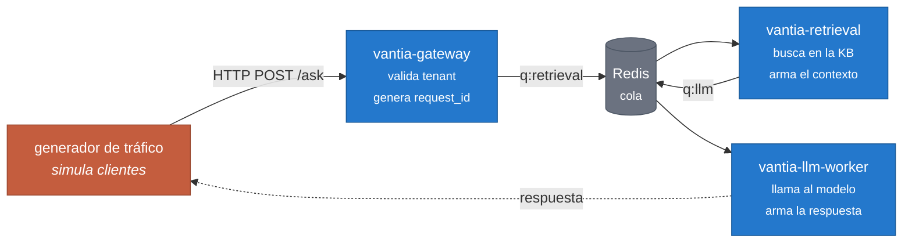
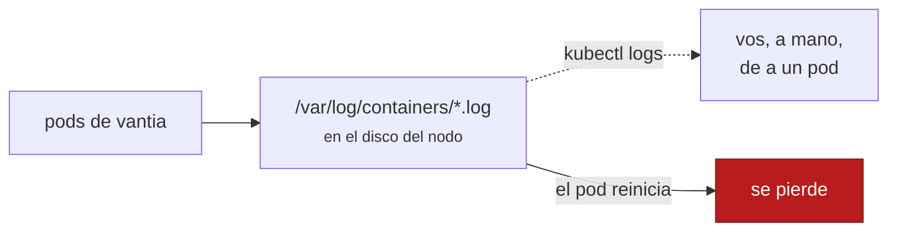
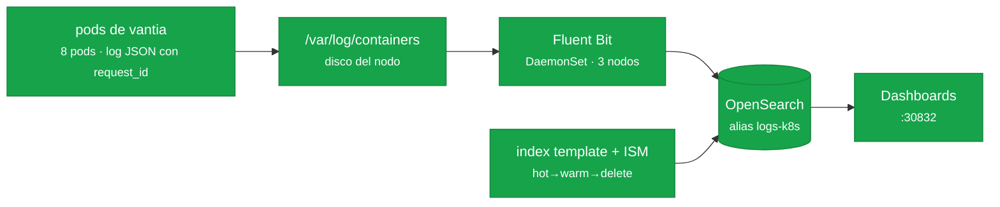
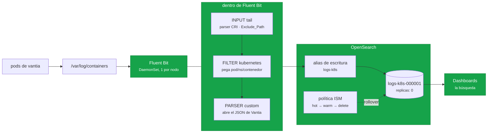
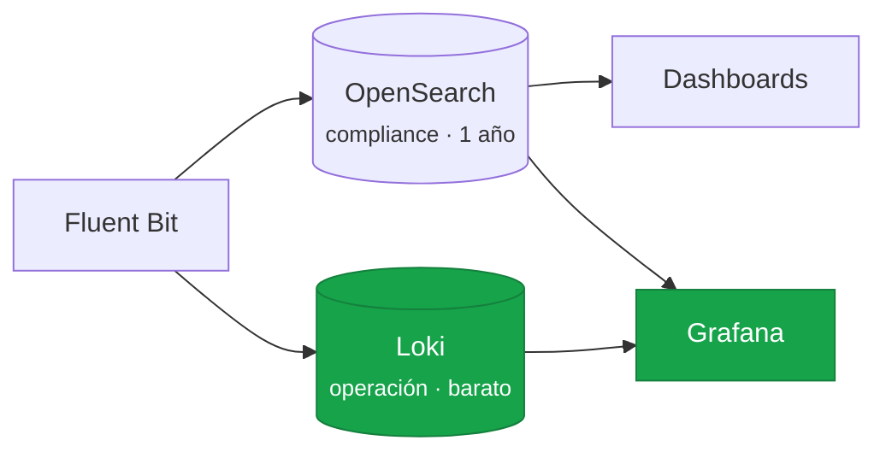
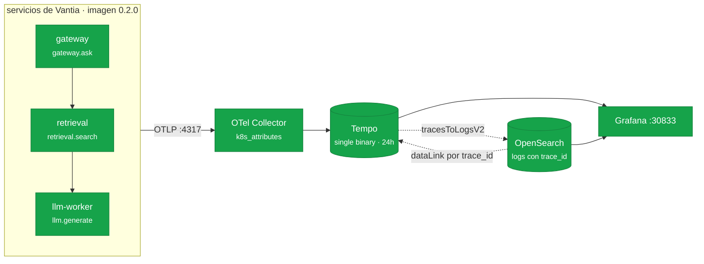
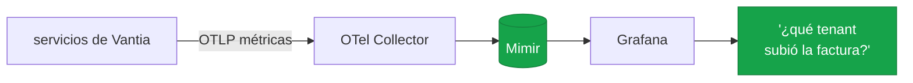
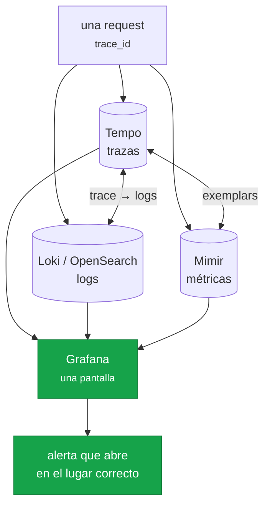

# Diagramas

## 1 — Los workloads de Vantia

Lo que la empresa tiene corriendo. Es lo que hay que observar; todavía no hay observabilidad acá.

**El problema que esto crea**: una sola consulta del cliente deja rastro en **tres procesos
distintos**, cada uno con su archivo de log, y todos se pierden cuando el pod reinicia. El
`request_id` que genera el gateway y arrastra por la cola es lo único que después permite volver a
juntarlos.

## 2 — La observabilidad, fase por fase

### Fase 0 — hoy (el punto de partida)

### Fase 1 — logs centralizados y correlacionados

**Estado hoy: la fase 1 está cerrada.** Todo verde.

Ya no hay una caja roja de «a mano, pod por pod»: una búsqueda por `request_id` devuelve la
conversación entera, ordenada, y sobrevive al reinicio de los pods.

**Estado objetivo** de la fase:

Dos detalles del dibujo que salieron de construirlo, y que no son decorativos:

- **`Exclude_Path` está en el INPUT, no en un filtro.** Si el descarte ocurriera después, Fluent Bit
  pagaría igual el costo de leer y de consultarle al API server la metadata de cada pod para tirarla
  a la basura. Y filtrar ahí es lo que evita que ingiera sus propios logs y los de OpenSearch, que se
  retroalimentan.
- **Fluent Bit escribe contra un alias, no contra un índice.** Es lo que permite que el rollover
  cambie el índice de destino por debajo sin tocar la configuración de Fluent Bit ni reiniciarlo.

**Lo que se cierra**: una búsqueda por `request_id` devuelve las líneas de los tres servicios, en
orden, sobrevive al reinicio de los pods y dura lo que diga la política de retención.

### Fase 2 — un pipeline, dos destinos

**Por qué dos**: no es comparar por deporte. OpenSearch está porque compliance pide un año buscable;
Loki porque ingeniería no quiere salir de Grafana y el costo a un año no cierra. Dos dueños, dos
motivos, **un solo pipeline** alimentándolos.

### Fase 2 — trazas (dolor cerrado, falta el post)

**Estado hoy**: el camino está completo y llega a Grafana. Falta demostrar la correlación.

**El contexto viaja dentro del mensaje de la cola**, igual que el `request_id` de la fase 1 — pero
ahora con `inject`/`extract` del estándar en vez de a mano. Verificado: los tres servicios comparten
`trace_id` y difieren en `span_id`.

Las dos flechas de la correlación están **demostradas**: desde un log se llega a su traza
(`queryType=traceId` devuelve los 3 spans) y desde una traza a sus logs (`trace_id:"..."` devuelve las
3 líneas). El dashboard `Vantia — one request, both signals` pone las dos cosas en una pantalla.

### Fase 4 — métricas de negocio: tokens y costo

### Fase 5 — las tres señales sobre una misma request

